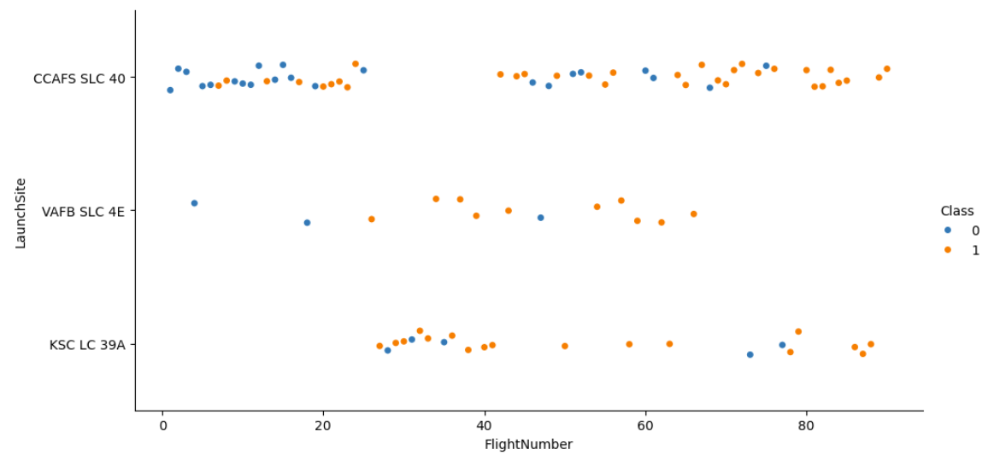
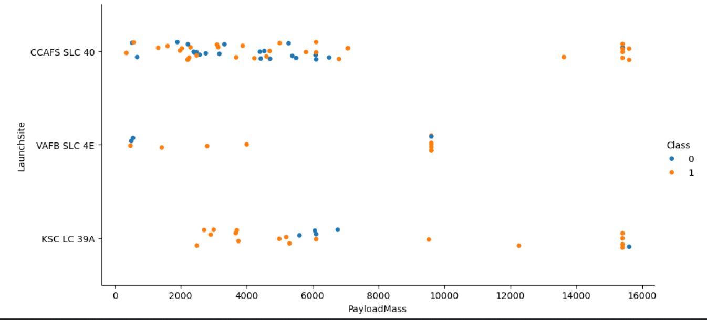
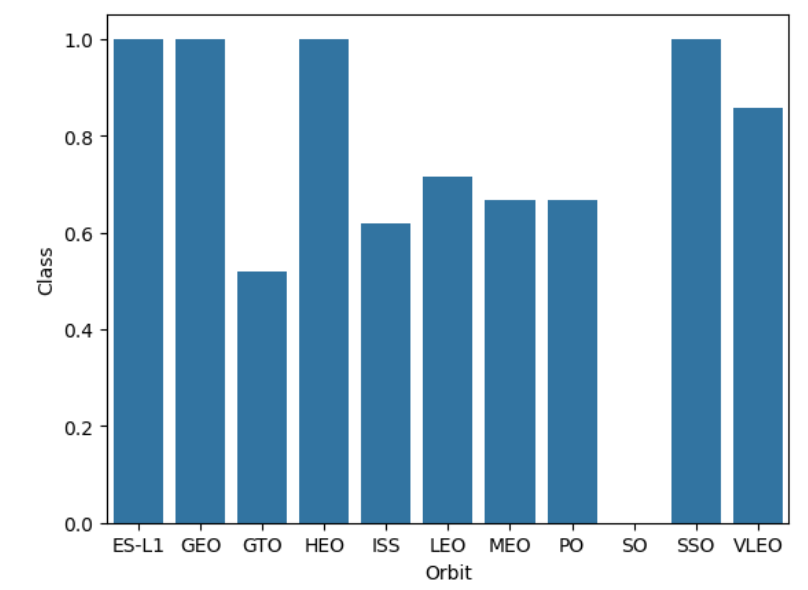
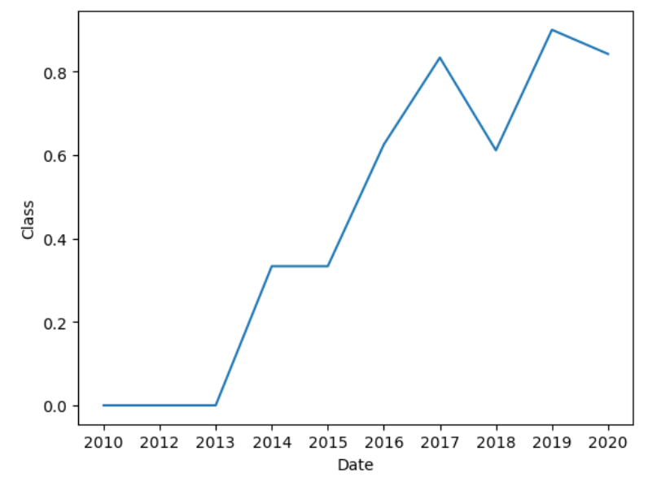
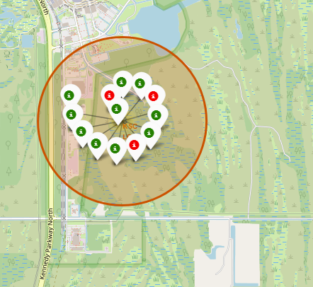
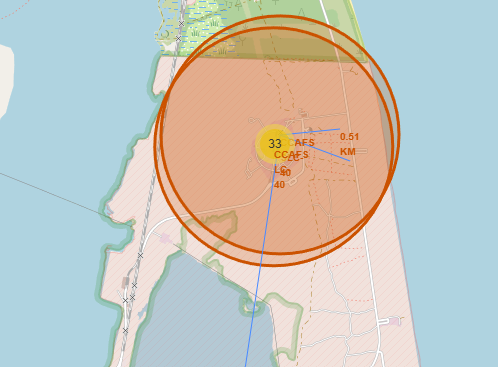
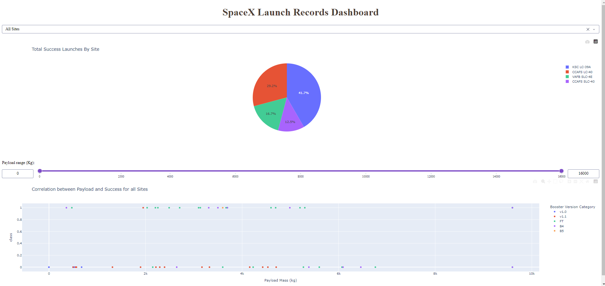
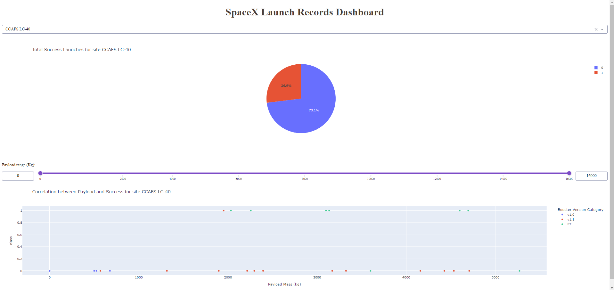
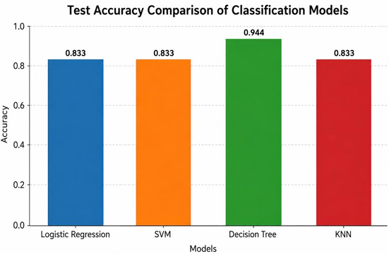
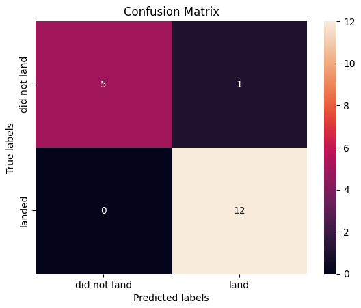

<div align="center">

# SpaceX Falcon 9 First Stage Landing Prediction

**Can we predict whether a Falcon 9 booster will land successfully — before the rocket even launches?**

An end-to-end data science project: from REST API and web scraping, through SQL and visual analytics, to interactive maps, a live dashboard, and machine learning classification.


</div>

---

## Table of Contents

- [At a Glance](#-at-a-glance)
- [Problem Statement](#-problem-statement)
- [Questions This Project Answers](#-questions-this-project-answers)
- [Methodology](#-methodology)
- [Data](#-data)
- [Repository Guide](#-repository-guide)
- [Analysis Highlights](#-analysis-highlights)
- [Model Results](#-model-results)
- [Key Insights](#-key-insights)
- [Tech Stack](#-tech-stack)
- [Credits & Data Sources](#-credits--data-sources)
- [License](#-license)
- [Author](#-author)

---

## At a Glance

| | |
|---|---|
| **Goal** | Predict whether the Falcon 9 first stage will land successfully (binary classification) |
| **Why it matters** | Booster reuse is the main reason SpaceX can price launches far below competitors |
| **Data** | SpaceX REST API + Wikipedia launch records |
| **Techniques** | API integration, web scraping, feature engineering, SQL (SQLite), EDA, geospatial analysis, dashboarding, supervised ML |
| **Models compared** | Logistic Regression · SVM · Decision Tree · K-Nearest Neighbors |
| **Best test accuracy** | **94.44%** — Decision Tree (see [Model Results](#-model-results)) |
| **Context** | Final project of the *IBM Data Science Professional Certificate* (Coursera) — *Applied Data Science Capstone* |

---

## Problem Statement

SpaceX advertises Falcon 9 launches at roughly **$62 million**, while other providers typically charge upwards of **$165 million**. Most of that saving comes from one thing: the **first stage can be recovered and reused**.

Imagine you work for a competing launch company that wants to bid against SpaceX. If you can predict whether the first stage will land, you can estimate the real cost of a launch and price your bid accordingly.

That is the task here: **use public launch data to predict first-stage landing success.**

---

## Questions This Project Answers

- How has the landing success rate changed over time as SpaceX gained experience?
- Do launch site, orbit type, payload mass, or booster version influence the outcome?
- Where are the launch sites, and how close are they to the coast, railways, highways, and cities?
- Which classification model predicts landing outcomes most reliably?

---

## Methodology


**1. Data collection** — Launch records pulled from the SpaceX REST API (with follow-up calls to resolve rocket, launchpad, payload, and core IDs), plus historical Falcon 9 launch tables scraped from Wikipedia with BeautifulSoup.

**2. Data wrangling** — Handled missing values (e.g. payload mass, landing pad), and converted the mission outcome into a binary target `Class` (`1` = landed successfully, `0` = did not).

**3. Exploratory data analysis** — Investigated relationships between flight number, payload mass, launch site, orbit, and landing outcome using Matplotlib/Seaborn, and answered structured questions with SQL queries in SQLite.

**4. Interactive analytics** — Built a Folium map of launch sites (with success/failure markers and distance measurements) and a Plotly Dash dashboard with site filters and a payload range slider.

**5. Predictive modeling** — Standardized features, split into training and test sets, tuned four classifiers with `GridSearchCV`, and compared them using test accuracy and confusion matrices.

---

## Data

| Source | How it was collected | Used for |
|---|---|---|
| SpaceX launch data (SpaceX REST API), accessed through the IBM lab notebook | `requests` + JSON normalization | Core launch dataset (rocket, payload, launchpad, core, landing outcome) |
| [Wikipedia – Falcon 9 and Falcon Heavy launches](https://en.wikipedia.org/wiki/List_of_Falcon_9_and_Falcon_Heavy_launches) | Web scraping with BeautifulSoup | Historical launch records and cross-checking |

**Key features used**

| Feature | Description |
|---|---|
| `FlightNumber` | Sequential launch number (proxy for SpaceX's accumulated experience) |
| `PayloadMass` | Payload weight in kg |
| `Orbit` | Target orbit (LEO, GTO, ISS, SSO, …) |
| `LaunchSite` | CCAFS LC-40, CCAFS SLC-40, KSC LC-39A, VAFB SLC-4E |
| `BoosterVersion` / `Block` | Booster generation and block |
| `Flights`, `GridFins`, `Reused`, `Legs` | Booster hardware and reuse status |
| `LandingPad`, `Serial` | Recovery pad and core serial number |
| **`Class`** | **Target variable — 1 = successful landing, 0 = failure** |

---

## Repository Guide

Notebooks are meant to be read in order. Each one produces the input for the next.

| # | File | Purpose |
|---|---|---|
| 01 | [`01_jupyter-labs-spacex-data-collection-api.ipynb`](01_jupyter-labs-spacex-data-collection-api.ipynb) | Collect launch data from the SpaceX REST API |
| 02 | [`02_jupyter-labs-webscraping.ipynb`](02_jupyter-labs-webscraping.ipynb) | Scrape Falcon 9 launch records from Wikipedia |
| 03 | [`03_labs-jupyter-spacex-Data wrangling.ipynb`](03_labs-jupyter-spacex-Data%20wrangling.ipynb) | Clean data and create the landing-success label |
| 04 | [`04_jupyter-labs-eda-sql-coursera_sqllite.ipynb`](04_jupyter-labs-eda-sql-coursera_sqllite.ipynb) | Exploratory analysis with SQL queries |
| 05 | [`05_edadataviz.ipynb`](05_edadataviz.ipynb) | Exploratory analysis with visualizations and feature engineering |
| 06 | [`06_lab_jupyter_launch_site_location.ipynb`](06_lab_jupyter_launch_site_location.ipynb) | Interactive launch-site map with Folium |
| 07 | [`07_spacex-dash-app.py`](07_spacex-dash-app.py) | Interactive dashboard with Plotly Dash |
| 08 | [`08_SpaceX_Machine Learning Prediction_Part_5 .ipynb`](08_SpaceX_Machine%20Learning%20Prediction_Part_5%20.ipynb) | Train, tune, and compare classification models |

<details>
<summary><b>Full folder structure</b></summary>

```text
SpaceX-Falcon-9-First-Stage-Landing-Prediction/
├── 01_jupyter-labs-spacex-data-collection-api.ipynb
├── 02_jupyter-labs-webscraping.ipynb
├── 03_labs-jupyter-spacex-Data wrangling.ipynb
├── 04_jupyter-labs-eda-sql-coursera_sqllite.ipynb
├── 05_edadataviz.ipynb
├── 06_lab_jupyter_launch_site_location.ipynb
├── 07_spacex-dash-app.py
├── 08_SpaceX_Machine Learning Prediction_Part_5 .ipynb
├── images/                    # screenshots and charts used in this README
├── dataset_part_1.csv         # raw data from the API
├── dataset_part_2.csv         # wrangled data with the Class label
├── dataset_part_3.csv         # feature-engineered data for ML
├── spacex_web_scraped.csv     # data scraped from Wikipedia
├── spacex_launch_dash.csv     # data used by the dashboard
├── LICENSE
└── README.md
```

</details>

---

## Analysis Highlights

### SQL exploration

Notebook `04` answers a set of business questions directly with SQL, such as:

<details>
<summary><b>Show the questions</b></summary>

- Which unique launch sites are used in the missions?
- Which launches came from sites whose name begins with `CCA`?
- What is the total payload mass carried for NASA (CRS) missions?
- What is the average payload mass carried by booster version F9 v1.1?
- When was the first successful landing on a ground pad?
- Which boosters landed successfully on a drone ship with a payload between 4,000 and 6,000 kg?
- How many successful and failed mission outcomes are there in total?
- Which booster versions carried the maximum payload mass?
- Which drone-ship landing failures occurred in 2015, and with which boosters and sites?
- How do landing outcomes rank between 2010-06-04 and 2017-03-20?

</details>

### Visual analytics

Notebook `05` explores how the landing outcome relates to flight number, payload mass, launch site, orbit, and year.

| Flight Number vs. Launch Site | Payload Mass vs. Launch Site |
|:---:|:---:|
|  |  |

| Success Rate by Orbit | Yearly Success Trend |
|:---:|:---:|
|  |  |

### Geospatial analysis with Folium

Notebook `06` maps every launch site, marks each launch as a success (green) or failure (red) using marker clusters, and measures the distance from a launch site to its nearest coastline, railway, highway, and city.





### Interactive dashboard with Plotly Dash

The dashboard (`07_spacex-dash-app.py`) lets users:

- pick **All Sites** or a single launch site from a dropdown,
- see the **share of successful launches** in a pie chart,
- filter by **payload range** with a slider,
- inspect **payload vs. outcome** in a scatter plot colored by booster version category.





---

## Model Results

**Setup**

- Features standardized with `StandardScaler`
- 80/20 train/test split (`test_size=0.2`, `random_state=2`), which leaves **18 samples** for testing
- Hyperparameters tuned with `GridSearchCV` (10-fold cross-validation)
- Four classifiers compared on the same held-out test set

| Model | Best Hyperparameters | CV Accuracy | Test Accuracy |
|---|---|:---:|:---:|
| Logistic Regression | `C=0.01`, `penalty=l2`, `solver=lbfgs` | 84.64% | 83.33% |
| Support Vector Machine | `C=1.0`, `gamma=0.0316`, `kernel=sigmoid` | 84.82% | 83.33% |
| **Decision Tree** | `criterion=entropy`, `max_depth=4`, `max_features=sqrt`, `min_samples_leaf=1`, `min_samples_split=10`, `splitter=best` | **88.75%** | **94.44%** |
| K-Nearest Neighbors | `algorithm=auto`, `n_neighbors=10`, `p=1` | 84.82% | 83.33% |

**Best model: Decision Tree**, with the highest score in both cross-validation (88.75%) and on the held-out test set (94.44%, or 17 of 18 launches classified correctly). The other three models tied at 83.33% (15 of 18).

| Model Comparison | Confusion Matrix (Decision Tree) |
|:---:|:---:|
|  |  |

**Reading the confusion matrix (Decision Tree, test set of 18 launches):**

| | Predicted: did not land | Predicted: landed |
|---|:---:|:---:|
| **Actual: did not land** | 5 | 1 |
| **Actual: landed** | 0 | 12 |

The model never missed a successful landing and made a single mistake: one launch that did not land was predicted to land (a false positive). The remaining models are weaker on the same point: Logistic Regression, for example, produced 3 false positives, which is why its test accuracy stops at 83.33%.

---

## Key Insights

- **Experience matters.** Landing success improves steadily as flight number and year increase, reflecting SpaceX's learning curve.
- **Launch site matters.** Success rates differ by launch site, with KSC LC-39A among the strongest performers.
- **Orbit matters, with a caveat.** Some orbits show a perfect success rate, but several of them have very few launches, so those rates should be read with caution.
- **Payload interacts with orbit.** Heavy payloads behave differently depending on the target orbit (for example GTO versus LEO/ISS).
- **Location is deliberate.** Launch sites sit close to the coast and away from cities, while still being connected to railways and highways for logistics.

---

## Tech Stack

| Area | Tools |
|---|---|
| Language | Python |
| Data collection | Requests, BeautifulSoup |
| Data processing | Pandas, NumPy |
| Database | SQLite, SQL |
| Visualization | Matplotlib, Seaborn, Plotly |
| Geospatial | Folium |
| Dashboard | Plotly Dash |
| Machine learning | Scikit-learn (Logistic Regression, SVM, Decision Tree, KNN, GridSearchCV) |
| Environment | Jupyter Notebook |

---

## Credits & Data Sources

- Project framework, lab instructions, and learning materials: **IBM Skills Network** via the *IBM Data Science Professional Certificate* on **Coursera**.
- Launch data: SpaceX launch data provided through the IBM lab notebooks, and [Wikipedia](https://en.wikipedia.org/wiki/List_of_Falcon_9_and_Falcon_Heavy_launches).
- This repository is an educational project.

---

## License

Lab instructions and learning materials from the IBM Data Science Professional Certificate remain the property of IBM Skills Network.

---

## Author

**Muhammad Danu Setiawan**

<div align="center">

</div>
